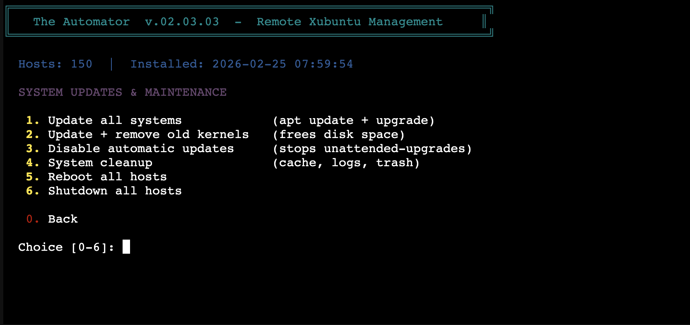
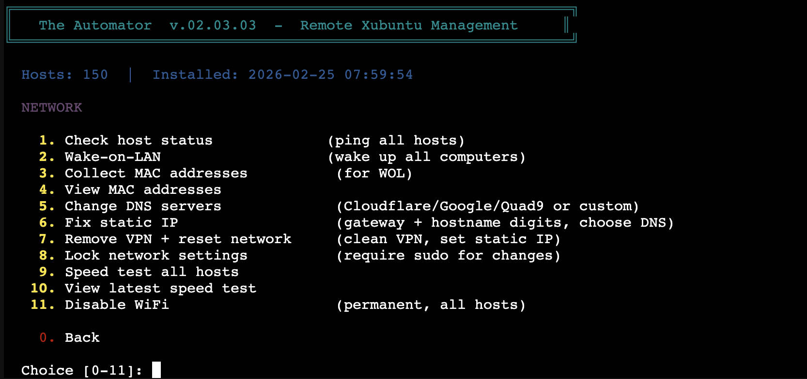
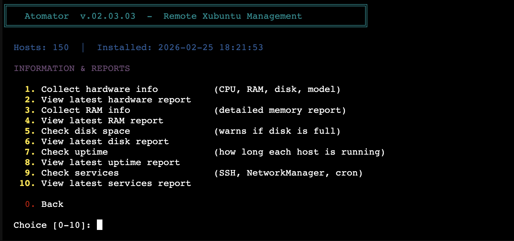
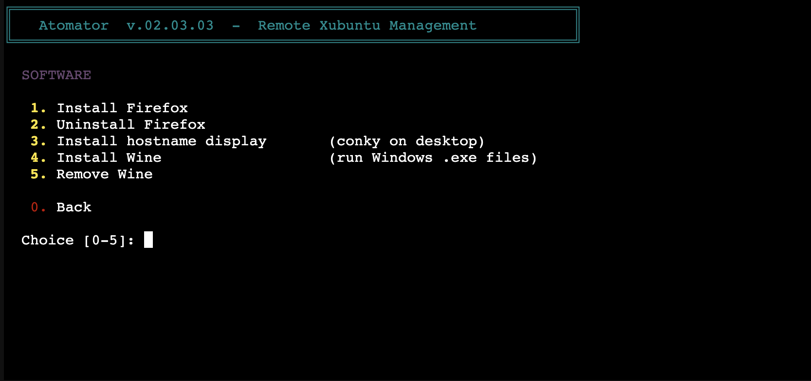
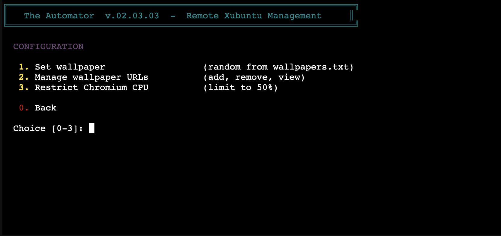
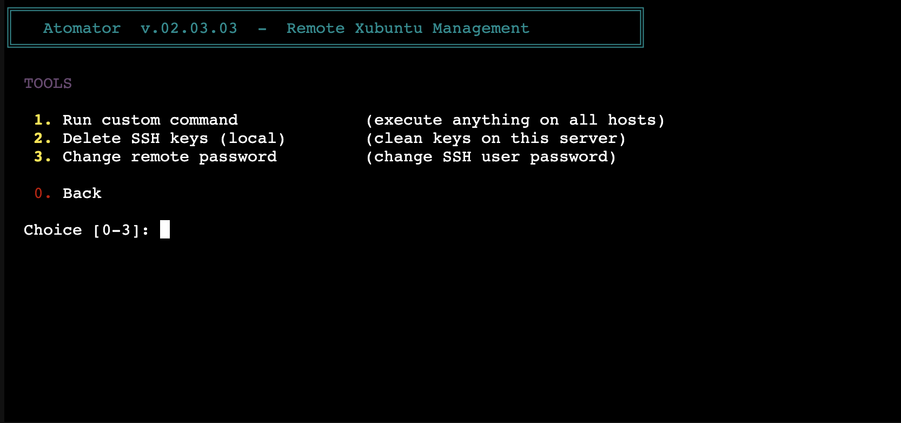
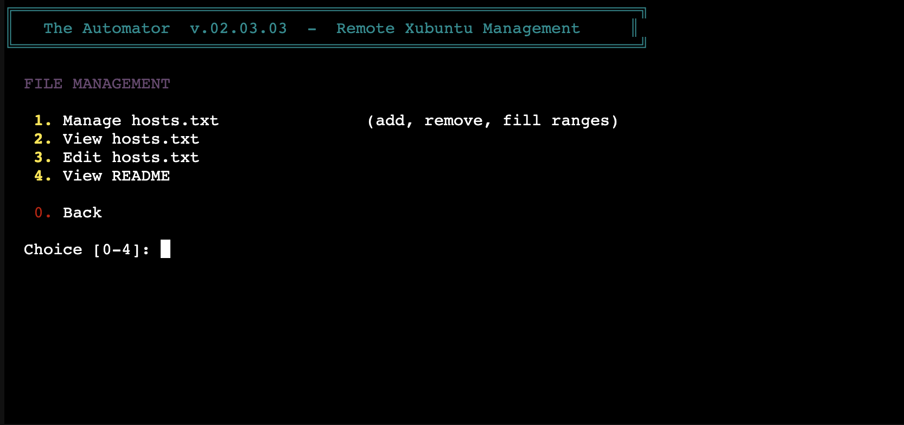

# Atomator - Remote Linux Fleet Management CLI

A command-line tool for managing fleets of Debian-based Linux computers from a single server. One interactive menu, 60+ scripts, SSH-based parallel execution. Built for sysadmins who need to maintain dozens (or hundreds) of machines without Ansible overhead.

**Compatible with all Debian-based distributions:**
- Debian 10+ (Buster, Bullseye, Bookworm, Trixie)
- Ubuntu 20.04+ / Xubuntu / Kubuntu / Lubuntu
- Linux Mint 20+
- Pop!_OS 20.04+
- Any distro using `apt` + `systemd` + NetworkManager

## Quick Start

```bash
# On your Debian server (as root):
sudo bash quick_install.sh

# Start the menu:
bash /root/start.sh
```

That's it. All scripts are installed to `/remote_tools/`, ready to use.

---

## Table of Contents

- [Requirements](#requirements)
- [Installation](#installation)
- [Credentials](#credentials)
- [How It Works](#how-it-works)
- [Menu Navigation](#menu-navigation)
- [Scripts Reference](#scripts-reference)
- [Updating](#updating)
- [File Structure](#file-structure)
- [Version History](#version-history)

---

## Requirements

### Server (where Atomator runs)

- Any Debian-based Linux (Debian 10+, Ubuntu 20.04+, etc.)
- Root access
- Packages: `sshpass`, `wakeonlan`, `bc`, `curl` (installed automatically by `quick_install.sh`)
- Network access to all managed hosts via SSH

### Managed Hosts (remote machines)

- Any Debian-based Linux with `apt` and `systemd`
- SSH server running (`openssh-server`)
- A user account with sudo privileges
- NetworkManager (standard on most desktop installs)

---

## Installation

**Fresh install:**

```bash
sudo bash quick_install.sh
```

This will:
- Install required packages (`sshpass`, `wakeonlan`, `bc`, `curl`)
- Create `/remote_tools/` with all scripts
- Create `/root/start.sh` launcher
- Generate `version.txt` with current version and install date

**What does NOT get overwritten:**
- `hosts.txt` (your host list)
- `credentials.conf` (your SSH credentials)
- `wallpapers.txt` (your wallpaper URLs)
- `watchdog_hosts.conf` (watchdog ping targets)

---

## Credentials

Atomator uses `credentials.conf` for SSH access:

```
SSH_USER=your_username
SSH_PASS=your_password
```

- Created on first run if missing (prompts you)
- Change password remotely via Tools menu → Change remote password
- Never committed to Git (in `.gitignore`)

---

## How It Works

1. You run `menu.sh` on your server
2. Pick an action from the menu (e.g., "Update all systems")
3. The script reads `hosts.txt` and `credentials.conf`
4. Connects via SSH to each host **in parallel** (configurable via `MAX_PARALLEL`, default 5-10)
5. Executes the command on each host
6. Shows progress `[1/20]`, elapsed time, and OK/FAIL results

### Key features:
- **Parallel execution** — up to 10x faster than sequential on large fleets
- **Progress counters** — `[current/total]` for every operation
- **Elapsed time** — shows how long each operation takes
- **SSH keepalive** — `ServerAliveInterval` prevents timeouts on slow connections
- **Automatic cleanup** — temp files removed via `trap` on exit
- **Consistent results** — OK/FAIL summary for every script

---

## Menu Navigation

```
Main Menu
├── 1. System Updates & Maintenance  (6 options)
├── 2. Network                       (12 options)
├── 3. Information & Reports         (11 options)
├── 4. Software                      (17 options)
├── 5. Configuration                 (3 options)
├── 6. Tools                         (7 options)
├── 7. File Management               (5 options)
├── 8. Update Scripts                (check GitHub)
└── 0. Exit
```

Hidden menu: enter `666` for Security Watchdog Controls.

---

## Scripts Reference

### 1. System Updates & Maintenance



| # | Script | Description |
|---|--------|-------------|
| 1 | `update_all.sh` | Runs `apt update && apt upgrade -y && apt autoremove -y && apt autoclean` on all hosts. |
| 2 | `update_and_remove_all.sh` | Same as above plus removes old kernels to free disk space. |
| 3 | `disable_auto_updates.sh` | Disables `unattended-upgrades`, all apt timers, update notifiers. Gives full manual control. |
| 4 | `cleanup_all.sh` | Clears apt cache, old logs, trash, and temp files on all hosts. |
| 5 | `reboot.sh` | Reboots all hosts in parallel (instant dispatch). |
| 6 | `shutdown_all.sh` | Shuts down all hosts in parallel. |

### 2. Network



Grouped into Status & Wake, DNS & IP, and Security & Testing sections.

| # | Script | Description |
|---|--------|-------------|
| | **Status & Wake** | |
| 1 | `check_hosts.sh` | Pings all hosts, shows online/offline status and hostname. |
| 2 | `wol_all.sh` | Sends Wake-on-LAN magic packets to all known MAC addresses. |
| 3 | `collect_mac_addresses.sh` | Gathers MAC addresses from all hosts via SSH. Saves to `mac_addresses.txt`. |
| 4 | View MAC addresses | Displays the collected `mac_addresses.txt` file. |
| | **DNS & IP** | |
| 5 | `change_dns.sh` | Changes DNS servers on all hosts (Cloudflare+Google+Quad9 or custom). |
| 6 | `fix_static_ip.sh` | Derives IP from gateway + hostname digits (e.g., BKSAL058 → .58). Sets static IP via NetworkManager. |
| 7 | `disable_wifi.sh` | Permanently disables WiFi: turns off radio, blocks with rfkill, blacklists common WiFi kernel modules, and configures NetworkManager to ignore WiFi devices. |
| | **Security & Testing** | |
| 8 | `remove_vpn_reset_network.sh` | Removes VPN packages and resets network to clean static IP config. |
| 9 | `require_sudo_network.sh` | Locks NetworkManager so network changes require sudo. Prevents users from modifying network settings. |
| 10 | `speedtest_all.sh` | Installs and runs `speedtest-cli` on each host. Measures ping, download, and upload. |
| 11 | View latest speed test | Displays the most recent speedtest results file. |
| 12 | `check_internet.sh` | Verifies each host can reach the internet using HTTP and ping tests. Shows which hosts have connectivity issues. |

### 3. Information & Reports



| # | Script | Description |
|---|--------|-------------|
| 1 | `collect_hardware_info.sh` | Collects CPU model, cores, total RAM, disk size, and machine model from each host. |
| 2 | View hardware report | Displays the most recent hardware info file. |
| 3 | `collect_ram_info.sh` | Gets detailed memory usage (total, used, free, available, swap) from each host. |
| 4 | View RAM report | Displays the most recent RAM info file. |
| 5 | `check_disk_space.sh` | Checks disk usage on all hosts. Warns when partitions are getting full. |
| 6 | View disk report | Displays the most recent disk space file. |
| 7 | `check_uptime.sh` | Shows how long each host has been running since last reboot. |
| 8 | View uptime report | Displays the most recent uptime file. |
| 9 | `check_services.sh` | Checks status of key services (SSH, NetworkManager, cron) on each host. |
| 10 | View latest services report | Displays the most recent services file. |
| 11 | `system_info_summary.sh` | Fleet health dashboard showing total RAM, disk warnings, and uptime statistics across all hosts. |

### 4. Software



Grouped into Install, Remove, and Fix sections.

| # | Script | Description |
|---|--------|-------------|
| | **Install** | |
| 1 | `install_firefox.sh` | Installs Firefox (or Firefox ESR as fallback) and creates a desktop shortcut for all users. |
| 2 | `install_chrome.sh` | Downloads and installs Google Chrome from Google's repository on all hosts. |
| 3 | `install_chromium.sh` | Installs Chromium browser from apt repositories on all hosts. |
| 4 | `install_wine.sh` | Installs Wine (32-bit and 64-bit) and Winetricks for running Windows .exe files. |
| 5 | `install_simplenote.sh` | Installs Simplenote note-taking app via snap on all hosts. |
| 6 | `install_redshift.sh` | Installs Redshift and redshift-gtk for automatic screen color temperature adjustment. Creates autostart entry for all users. |
| 7 | `install_xpad.sh` | Installs Xpad sticky notes application on all hosts. |
| 8 | `install_hostname_display.sh` | Installs Conky and creates a configuration that displays the computer's hostname in the bottom-right corner of the desktop. Auto-starts on login. |
| 9 | `install_package.sh` | Installs any apt package by name on all hosts. Prompts for the package name and runs apt install on every host. |
| | **Remove** | |
| 10 | `uninstall_firefox.sh` | Removes Firefox and locale packages. User profiles in `~/.mozilla` are kept. |
| 11 | `remove_chrome.sh` | Removes Google Chrome from all hosts. |
| 12 | `remove_chromium.sh` | Removes Chromium browser from all hosts. |
| 13 | `remove_wine.sh` | Removes Wine packages and deletes all `~/.wine` directories. |
| 14 | `remove_simplenote.sh` | Removes Simplenote from all hosts. |
| 15 | `remove_redshift.sh` | Removes Redshift and its autostart entries from all hosts. |
| 16 | `remove_xpad.sh` | Removes Xpad from all hosts. |
| | **Fix** | |
| 17 | `fix_hostname_display.sh` | Repairs hostname display: kills stuck conky processes, recreates config and autostart, starts conky immediately. |

### 5. Configuration



| # | Script | Description |
|---|--------|-------------|
| 1 | `set_wallpaper.sh` | Picks a random URL from `wallpapers.txt`, downloads the image, and sets it as wallpaper for all users on all hosts. Works with XFCE desktop. |
| 2 | `manage_wallpapers.sh` | Interactive menu to manage `wallpapers.txt`: add URLs, remove entries, view current list, or clear all. |
| 3 | `restrict_chromium_cpu.sh` | Installs `cpulimit` and creates a systemd service that limits all Chromium processes to 50% CPU. Prevents Chromium from eating all system resources. Starts automatically on boot. |

### 6. Tools



Grouped into Remote and Fix sections.

| # | Script | Description |
|---|--------|-------------|
| | **Remote** | |
| 1 | `run_remote_command.sh` | Prompts you for a command, then runs it as root on every host. Full output is shown for each host. Use this for one-off commands you don't have a script for. |
| 2 | `change_password.sh` | Changes the SSH user's password on all remote hosts. Asks for the new password (with confirmation), updates each host, then saves the new password to `credentials.conf`. |
| 3 | `copy_file_to_all.sh` | SCP a file to the same path on every host. Prompts for the local file path. |
| 4 | `lock_screens.sh` | Locks all screens instantly across all hosts. |
| 5 | `send_message.sh` | Sends a popup notification to all desktops on all hosts. |
| | **Fix** | |
| 6 | `delete_ssh_keys.sh` | Deletes all SSH keys for all users and root on **this server only** (not remote hosts). Clears known_hosts and authorized_keys, then regenerates the host keys. Asks for confirmation. |
| 7 | `fix_slow_sudo.sh` | Fixes slow sudo by adding each host's hostname to `/etc/hosts`. Prevents DNS lookup timeout that causes sudo to hang for seconds. |

### 7. File Management



| # | Action | Description |
|---|--------|-------------|
| 1 | `manage_hosts.sh` | Interactive menu: add hosts, remove hosts, add IP ranges, clear all. |
| 2 | View hosts.txt | Shows the current host list with line numbers. |
| 3 | Edit hosts.txt | Opens `hosts.txt` in your default editor (nano). |
| 4 | View README | Displays the README documentation using `less`. |
| 5 | `view_log.sh` | Shows the last 30 menu actions from `debug.log` for quick troubleshooting. |

### 8. Update Scripts

Runs `update.sh` which checks for the latest version on GitHub:
1. **Update from GitHub** - Downloads each script individually from the repository (no monolithic installer needed)
2. **Reinstall/refresh** - Re-downloads all scripts even if already on the latest version
3. **Revert to a previous version** - Lists all stored versions in `updates/` and lets you pick one to revert to

The update process shows version comparison and changelog between your current version and the new version.

See [Updating](#updating) for details.

### Hidden: Security Watchdog (menu code 666)

| # | Script | Description |
|---|--------|-------------|
| 1 | `install_connectivity_watchdog.sh` | Installs a cron-based watchdog that reboots the host if it can't reach configured ping targets for 72h (configurable). |
| 2 | `remove_connectivity_watchdog.sh` | Removes the watchdog cron job and config. |
| 3 | `check_watchdog_status.sh` | Shows watchdog status (installed, timer, ping hosts) on all hosts. |
| 4 | `configure_watchdog_hosts.sh` | Changes which hosts the watchdog pings to check connectivity. |
| 5 | `change_watchdog_timer.sh` | Changes the timeout before forced reboot (default 72h). |
| 6 | `install_server_watchdog.sh` | Installs watchdog on an additional server (prompts for credentials). |

---

## Updating

**Option 1: Download from GitHub (recommended)**

1. Open the menu: `bash /root/start.sh`
2. Choose option **8** (Update Scripts)
3. If a new version is available, confirm to download
4. The updater downloads each `.sh` file individually from GitHub
5. Config files (`hosts.txt`, `credentials.conf`, etc.) are preserved

Or run directly:
```bash
cd /remote_tools && bash update.sh
```

**Option 2: Revert to a previous version**

1. Choose option **8** (Update Scripts)
2. If already on latest, choose "Revert to a previous local version"
3. Pick a version from the `updates/` directory

### What Happens During Update

1. Shows your current version and install date
2. Checks GitHub for the latest version
3. Shows version comparison and changelog between versions
4. Asks for confirmation
5. Downloads each `.sh` file individually from GitHub
6. Preserves config files (`hosts.txt`, `credentials.conf`, `wallpapers.txt`, `watchdog_hosts.conf`)
7. Updates `version.txt` with the new version and install date

---

## File Structure

```
/remote_tools/
  menu.sh                              # Main interactive menu
  update.sh                            # Version checker and updater
  hosts.txt                            # One IP per line (your hosts)
  credentials.conf                     # SSH_USER and SSH_PASS
  wallpapers.txt                       # Wallpaper URLs
  version.txt                          # Current version + install date
  updates/                             # Stored versions for revert
    update_v.02.01.00.sh
    update_v.02.02.00.sh
    ...
  screenshots/                         # Menu screenshots for README
  install_connectivity_watchdog.sh      # Install network watchdog
  install_connectivity_watchdog_test.sh # Install watchdog test mode
  remove_connectivity_watchdog.sh       # Remove network watchdog
  remove_connectivity_watchdog_test.sh  # Remove watchdog test mode
  monitor_watchdog_test_live.sh         # Live monitor for watchdog test
  install_server_watchdog.sh            # Install server watchdog
  change_watchdog_timer.sh              # Change watchdog timer interval
  check_watchdog_status.sh             # Check watchdog status
  configure_watchdog_hosts.sh          # Configure watchdog ping hosts
  system_info_summary.sh               # Fleet health dashboard
  check_internet.sh                    # Verify internet connectivity on all hosts
  install_package.sh                   # Install any apt package on all hosts
  copy_file_to_all.sh                  # SCP a file to all hosts
  lock_screens.sh                      # Lock all screens instantly
  send_message.sh                      # Send popup notification to all desktops
  view_log.sh                          # Show last 30 menu actions from debug.log
  create_all_scripts.sh                # Create all scripts locally
  create_deployment_package.sh         # Create deployment package (.tar.gz)
  install_all_scripts.sh               # Install all scripts from package
  quick_install.sh                     # Fresh install/upgrade script
  manage_hosts.sh                      # Manage hosts.txt

/root/
  start.sh                         # Quick launcher: cd /remote_tools && bash menu.sh
```

---

## Configuration Files

### hosts.txt

```
# One IP per line. Comments start with #
192.168.1.50
192.168.1.51
192.168.1.52
```

- Used by all SSH-based scripts at runtime
- Managed via File Management menu or edit directly
- Supports comments and blank lines

### credentials.conf

```
SSH_USER=admin
SSH_PASS=your_password_here
```

- Created on first run
- Updated when you change password via Tools menu
- In `.gitignore` — never committed

### wallpapers.txt

```
https://example.com/wallpaper1.jpg
https://example.com/wallpaper2.png
```

- One URL per line
- Managed via Configuration menu
- `set_wallpaper.sh` picks a random URL from this list

---

## Common Script Patterns

All scripts follow the same structure:

```bash
#!/bin/bash
# Read hosts and credentials
# Execute command on each host in PARALLEL (up to MAX_PARALLEL)
# Show progress [current/total]
# Display OK/FAIL summary
# Show elapsed time
```

- Generates all management scripts (60+)
- All use `sshpass` + `ssh` with StrictHostKeyChecking disabled
- Parallel execution with configurable `MAX_PARALLEL` (default 5-10)
- `ServerAliveInterval` prevents SSH timeouts
- Temp files cleaned up via `trap` on exit

---

## Version History

| Version | Date | Changes |
|---------|------|---------|
| v.02.09.00 | 2026-05-14 | Major Feature Release: 7 new scripts (system_info_summary, check_internet, install_package, copy_file_to_all, lock_screens, send_message, view_log), expanded menus, fleet management improvements, complete documentation overhaul. |
| v.02.08.03 | 2026-05-08 | Fixed rate limits in updater (uses raw.githubusercontent.com), changelog display during updates, custom watchdog timer prompt, all files synced. |
| v.02.08.02 | 2026-05-08 | New update mechanism: downloads individual files from GitHub instead of monolithic installer. Instant updates on every push. |
| v.02.08.01 | 2026-05-08 | Complete UI redesign: modern TUI with emoji icons, branded header, subsection labels, clean prompt. |
| v.02.08.00 | 2026-05-08 | Performance: all scripts now execute in parallel (configurable via MAX_PARALLEL env var). Up to 10x faster on large fleets. Added elapsed time, progress counters, ServerAliveInterval, and consistent result summaries. |
| v.02.07.04 | 2026-02-27 | Fix hostname display: proper restart without reboot - kills old conky cleanly then starts fresh. |
| v.02.07.03 | 2026-02-27 | Fixed black background: enables Xfce compositor for true ARGB transparency on hostname display. |
| v.02.07.02 | 2026-02-27 | Hostname display: black outline on white text, positioned closer to taskbar. |
| v.02.07.01 | 2026-02-27 | Fixed duplicate hostname display and black background. Cleans up all old conky configs, uses pseudo-transparency. |
| v.02.07.00 | 2026-02-27 | Redesigned all menus with section dividers, spacing, and descriptions for every item. |
| v.02.06.02 | 2026-02-27 | Fixed fix_hostname_display.sh hanging: conky now fully detached with nohup so SSH doesn't get stuck. |
| v.02.06.01 | 2026-02-27 | Improved fix_slow_sudo.sh: fixes 127.0.1.1 line, nsswitch.conf order, verifies hostname resolution. |
| v.02.06.00 | 2026-02-27 | Added removal for Simplenote and Redshift. Added install/remove for Google Chrome, Chromium, and Xpad. Software menu now has 16 options. |
| v.02.05.01 | 2026-02-27 | Added fix_hostname_display.sh - repairs conky hostname display when not showing. |
| v.02.05.00 | 2026-02-27 | Added fix_slow_sudo.sh to Tools menu - fixes slow sudo by adding hostname to /etc/hosts on all hosts. |
| v.02.04.01 | 2026-02-27 | Fixed GitHub update: use API endpoint instead of raw CDN to avoid cache delay. |
| v.02.04.00 | 2026-02-27 | Added install_simplenote.sh and install_redshift.sh to Software menu. |
| v.02.03.03 | 2026-02-25 | check_hosts.sh now shows hostname for online hosts via SSH. |
| v.02.03.02 | 2026-02-25 | Changelog reversed: oldest first, newest last. Latest changes now visible at bottom of update screen. |
| v.02.03.01 | 2026-02-25 | Update screen now shows changelog from the new version being installed instead of the old one. |
| v.02.03.00 | 2026-02-25 | fix_static_ip.sh derives IP from gateway + hostname digits instead of keeping DHCP address. |
| v.02.02.01 | 2026-02-25 | Custom DNS option in fix_static_ip.sh (keep current / Cloudflare+Google+Quad9 / custom) and change_dns.sh (Cloudflare+Google+Quad9 / custom). |
| v.02.02.00 | 2026-02-24 | Standardized all 6 report files to consistent TSV format. All reports have header, tab-separated column headers, one row per host. Easy to copy-paste into spreadsheets. Added Used column to disk space, flattened services to one row per host, parsed speedtest into columns. |
| v.02.01.01 | 2026-02-24 | Fixed: VPN removal script wiped DNS causing total network loss on all hosts. Fixed: static IP script now always sets DNS with fallback to 1.1.1.1/8.8.8.8/9.9.9.9. |
| v.02.01.00 | 2026-02-24 | Renamed to "Atomator". New version format v.XX.YY.AA. Credentials system (`credentials.conf`) replaces hardcoded passwords. Password change script. Debug menu logging. Update catalog with version revert. Changelog display on updates. Wallpaper management script. Watchdog host configuration. View README from menu. Fixed: sudo command not found in update menu. |
| v.02.00.00 | 2026-02-23 | Submenu system (8 categories), report viewers for all data collectors, GitHub update support, delete SSH keys now local-only, timestamped output files for disk/uptime/services scripts. |
| v.01.00.00 | 2026-02-23 | Complete rewrite. 34 scripts, new menu with descriptions, version system, update mechanism. Added shutdown, disk space, uptime, services scripts. Consistent error handling across all scripts. |
